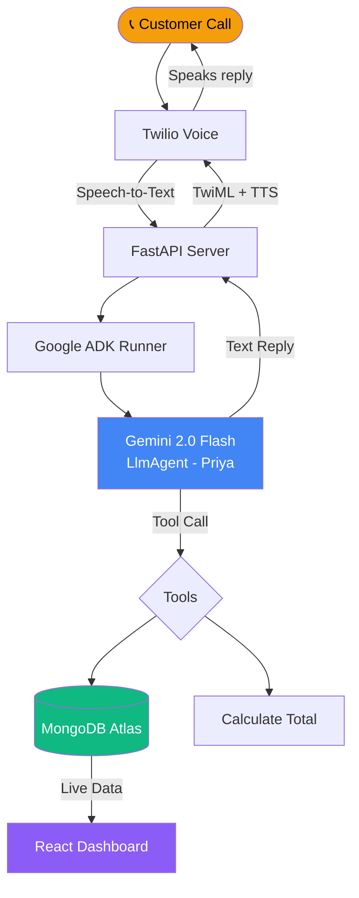
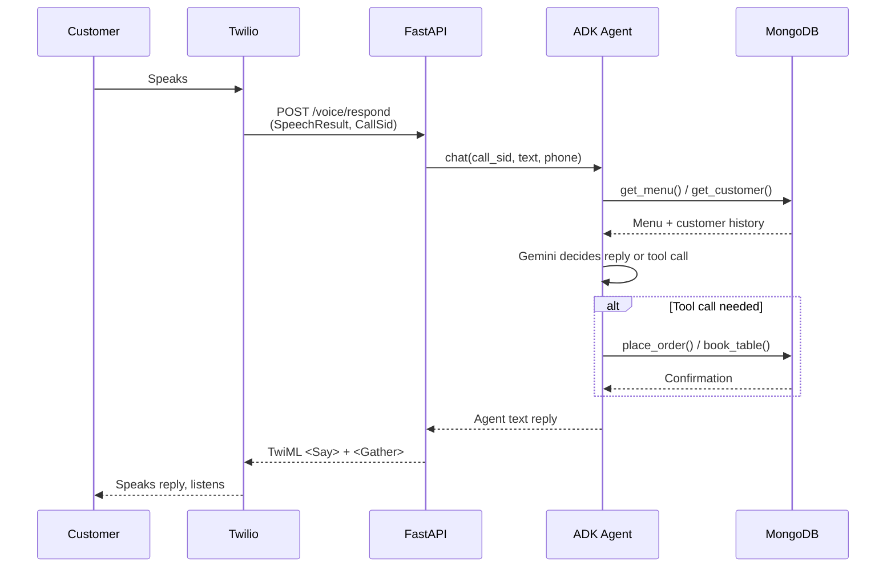
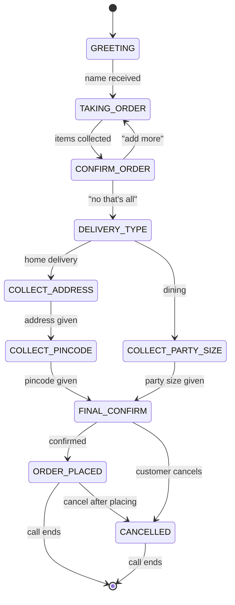
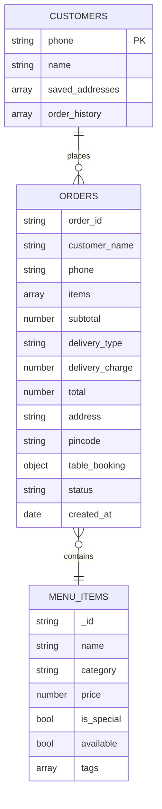

# 🍛 Call2Cart — AI Phone Ordering Agent

> A real phone number. A real conversation. A real order placed — no app, no typing.

Customers call a Twilio number and speak naturally. An AI agent (Google ADK + Gemini) handles the entire ordering flow — takes the order, confirms it, collects delivery details, writes to MongoDB, and updates the admin dashboard live.

---

## Demo Flow

```
Customer: "Hi, I'm Krishna. I'd like to order from Kukkad Nukkad."
  Priya:  "Hi Krishna! What would you like to have today?"
Customer: "2 Dal Makhani, 4 Garlic Naan, 1 Veg Pulao."
  Priya:  "Got it! 2 Dal Makhani, 4 Garlic Naan, 1 Veg Pulao — anything else?"
Customer: "No that's it."
  Priya:  "Dining in or home delivery? Delivery has a ₹40 charge."
Customer: "Home delivery."
  Priya:  "What's your address?"
Customer: "MyHostelRoom Aurora, Mohan Nagar, Dhankwadi."
  Priya:  "And the pincode?"
Customer: "411043."
  Priya:  "Perfect. Your total is ₹1240. Shall I place the order?"
Customer: "Yes."
  Priya:  "Order placed! Estimated delivery in 45 minutes. Have a great day!"
```

---

## Architecture

### System Overview



---

### Call Loop (Per Conversation Turn)



---

### Conversation State Machine



---

### MongoDB Collections



---


## Tech Stack

| Layer | Technology |
|-------|-----------|
| Phone | Twilio Voice (STT + TTS) |
| Voice | Amazon Polly — `Polly.Aditi` (Indian English) |
| Agent | Google ADK `LlmAgent` |
| LLM | Gemini 2.0 Flash |
| Backend | FastAPI + Uvicorn |
| Database | MongoDB Atlas + Motor (async) |
| Dashboard | React + Recharts |

---

## Setup

### 1. Clone & Install

```bash
git clone https://github.com/Krishna-Rao-dev/Google_APL
pip install -r requirements.txt
```

### 2. Environment Variables

```bash
cp .env.example .env
```

| Variable | Where to get |
|----------|-------------|
| `TWILIO_ACCOUNT_SID` | [Twilio Console](https://console.twilio.com) |
| `TWILIO_AUTH_TOKEN` | Twilio Console |
| `TWILIO_PHONE_NUMBER` | Your Twilio number |
| `MONGODB_URI` | [MongoDB Atlas](https://cloud.mongodb.com) → Connect |
| `GOOGLE_API_KEY` | [Google AI Studio](https://aistudio.google.com) |

### 3. Run

```bash
# Backend
uvicorn backend.main:app --reload --port 8000

# Expose publicly (dev)
ngrok http 8000
```

### 4. Twilio Console

Go to **Phone Numbers → Your Number → Voice Configuration**:

| Field | Value |
|-------|-------|
| A call comes in | `https://YOUR_URL/voice` — HTTP POST |
| Call status changes | `https://YOUR_URL/voice/status` — HTTP POST |

### 5. Dashboard

```bash
cd dashboard
npm install
npm run dev
# → http://localhost:5173
```

---

## Agent Tools

| Tool | Triggers When | DB Action |
|------|--------------|-----------|
| `get_menu(category?)` | Customer asks what's available / special | READ menu_items |
| `calculate_total(items, type)` | Order confirmed, delivery type chosen | None |
| `place_order(...)` | Customer gives final "yes" | WRITE orders + UPSERT customers |
| `book_table(order_id, party_size)` | Dining chosen | UPDATE orders.table_booking |
| `cancel_order(order_id)` | Customer cancels at any point | UPDATE orders.status |

---

## Special Cases

| Scenario | Behaviour |
|----------|-----------|
| "What's special today?" | `get_menu(category="special")` → reads `is_special: true` items |
| Customer changes order mid-way | Agent updates items, re-confirms full order |
| Cancel before placing | Agent confirms cancellation, ends call gracefully |
| Cancel after placing | `cancel_order()` called, status → `cancelled` in DB |
| Dining chosen | Skips address flow, asks party size → `book_table()` |
| Returning customer | Saved address offered automatically at delivery step |

---

## Admin Dashboard

Three tabs, live-polling every 15 seconds from MongoDB:

**Overview** — Today's revenue, order count, active orders, top items bar chart, revenue by day line chart

**Deliveries** — Live table of all delivery orders with status control (placed → preparing → out for delivery → delivered)

**Dining** — Card grid of table bookings showing party size, customer, items, with one-click status buttons (booked → seated → done)

---

## Deployment (Production)

```bash
# Railway / Render — set env vars in dashboard, deploy from GitHub
# MongoDB Atlas — free M0 cluster works for low volume
# Twilio — swap ngrok URL for your Railway/Render URL in console
```

No code changes needed between dev and prod — just swap the public URL.

---

> Built with Google ADK · Gemini 2.0 Flash · FastAPI · MongoDB · Twilio
