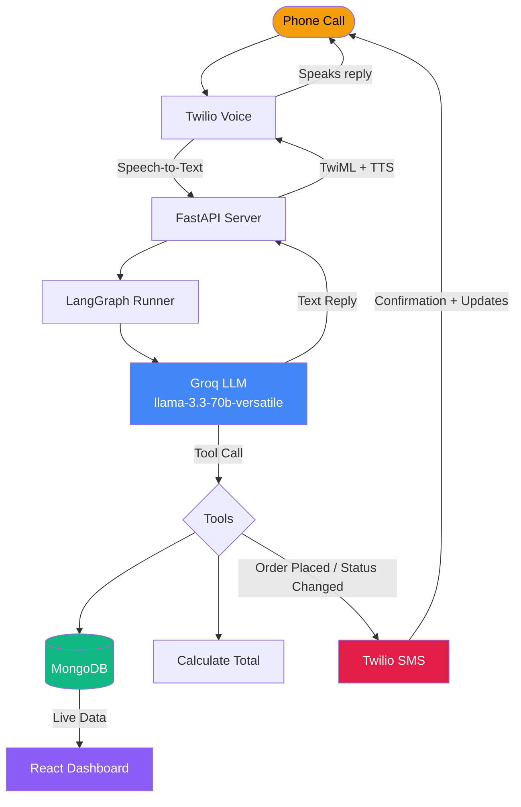
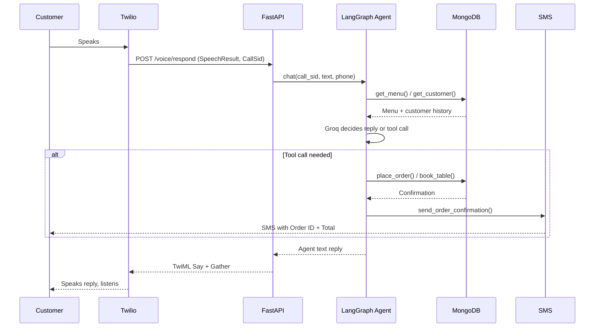
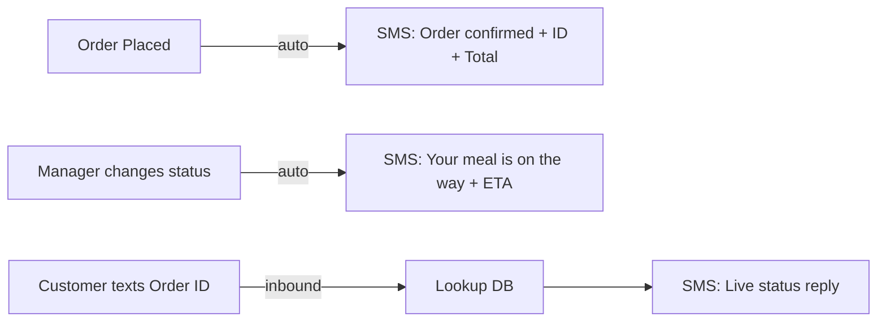
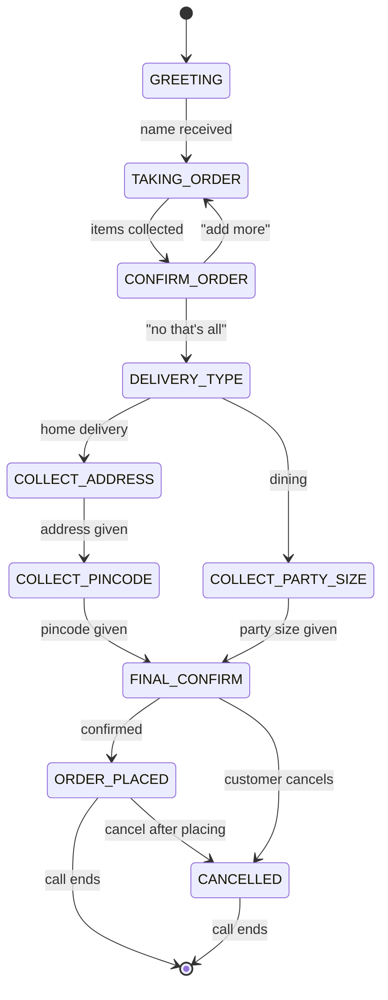
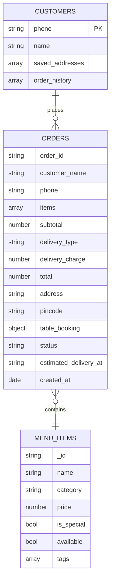

# Call2Cart — AI Phone Ordering Agent

> A real phone number. A real conversation. A real order placed — no app, no typing.

Customers call a Twilio number and speak naturally. An AI agent (LangGraph + Groq) handles the entire ordering flow — takes the order, confirms it, collects delivery details, writes to MongoDB, updates the admin dashboard live, and sends SMS confirmations.

---

## Demo Flow

```
Customer: "Hi, I'm Krishna. I'd like to order from Kukkad Nukkad."
  Agent:  "Hi Krishna! What would you like to have today?"
Customer: "2 Dal Makhani, 4 Garlic Naan, 1 Veg Pulao."
  Agent:  "Got it! 2 Dal Makhani, 4 Garlic Naan, 1 Veg Pulao — anything else?"
Customer: "No that's it."
  Agent:  "Dining in or home delivery? Delivery has a Rs.40 charge."
Customer: "Home delivery."
  Agent:  "What's your address?"
Customer: "Pune Institute Of Computer Technology, Dhankwadi."
  Agent:  "And the pincode?"
Customer: "411043."
  Agent:  "Perfect. Your total is Rs.820. Shall I place the order?"
Customer: "Yes."
  Agent:  "Order placed! Estimated delivery in 45 minutes. Have a great day!"
```

## REAL TIME DEMO:

[CALL LOG.mp3](https://github.com/user-attachments/files/28613231/CALL.LOG.mp3)
<br/>
<br/>
- `00:00 - 00:05` - Automated Caller Recognition & Session Initialization
- `00:05 - 00:21` - Multi-Item Entity Extraction and Order State Tracking
- `00:21 - 00:43` - Live Barge-In Detection and Dynamic Order Updates
- `00:43 - 01:03` - Historical Customer Profile Retrieval & Address Resolution
- `01:03 - 01:22` - Dynamic Pricing Engine and Delivery Charge Computation
- `01:22 - 01:38` - Order Verification and Transaction Commitment
- `01:38 - 01:47` - Automated Twilio Notification Dispatch

## CONFIRMATION MESSAGE VIA SMS


## GETS LOGGED ON DASHBOARD OF THE RESTAURANT


## LIVE DELIVERY PROGRESS UPDATES TO THE CUSTOMER


---

## Architecture

### System Overview



---

### Call Loop (Per Conversation Turn)



---

### SMS Flow



---

### Conversation State Machine



---

### MongoDB Collections



---

## Tech Stack

| Layer | Technology |
|-------|-----------|
| Phone | Twilio Voice (STT + TTS) |
| Voice | Amazon Polly — `Polly.Aditi` (Indian English) |
| Agent | LangGraph `StateGraph` |
| LLM | Groq — `llama-3.3-70b-versatile` |
| Backend | FastAPI + Uvicorn |
| Database | MongoDB + Motor (async) |
| Dashboard | React + Recharts |
| Notifications | Twilio SMS |

---

## Project Structure

```
restaurant-agent/
├── backend/
│   ├── __init__.py
│   ├── main.py              # FastAPI + Twilio voice & SMS webhooks
│   ├── agent.py             # LangGraph StateGraph + Groq LLM + session mgmt
│   ├── tools.py             # All agent tools + order draft store
│   ├── db.py                # Motor async MongoDB client + seed
│   ├── sms.py               # SMS confirmations + inbound status checks
│   └── dashboard_routes.py  # /dashboard GET, /orders/:id/status PATCH
├── dashboard/
│   └── src/
│       └── App.jsx          # React: Overview, Deliveries, Dining, Menu tabs
├── requirements.txt
├── .env.example
└── README.md
```

---

## Setup

### 1. Clone & Install

```bash
git clone https://github.com/Krishna-Rao-dev/Google_APL
pip install -r requirements.txt
```

### 2. Environment Variables

```bash
cp .env.example .env
```

| Variable | Where to get |
|----------|-------------|
| `TWILIO_ACCOUNT_SID` | [Twilio Console](https://console.twilio.com) |
| `TWILIO_AUTH_TOKEN` | Twilio Console |
| `TWILIO_PHONE_NUMBER` | Your Twilio number |
| `MONGODB_URI` | [MongoDB Atlas](https://cloud.mongodb.com) → Connect |
| `GROQ_API_KEY` | [Groq Console](https://console.groq.com) |

### 3. Run

```bash
# Backend
uvicorn backend.main:app --reload --port 8000

# Expose publicly (dev)
ngrok http 8000
```

### 4. Twilio Console

**Voice:**

| Field | Value |
|-------|-------|
| A call comes in | `https://YOUR_URL/voice` — HTTP POST |
| Call status changes | `https://YOUR_URL/voice/status` — HTTP POST |

**Messaging:**

| Field | Value |
|-------|-------|
| A message comes in | `https://YOUR_URL/sms` — HTTP POST |

### 5. Dashboard

```bash
cd dashboard
npm install
npm run dev
# → http://localhost:5173
```

---

## Agent Tools

| Tool | Triggers When | DB Action |
|------|--------------|-----------|
| `get_menu(category?)` | Customer asks what's available / special | READ menu_items |
| `save_order_draft(...)` | Customer gives any detail — name, items, address, pincode | None (in-memory) |
| `calculate_total(items, type)` | Order confirmed, delivery type chosen | None |
| `place_order(...)` | Customer gives final "yes" | WRITE orders + UPSERT customers |
| `book_table(order_id, party_size)` | Dining chosen | UPDATE orders.table_booking |
| `cancel_order(order_id)` | Customer cancels at any point | UPDATE orders.status |

## SMS Features

| Event | Trigger | Message |
|-------|---------|---------|
| Order confirmed | Automatic after `place_order` | Order ID, total, delivery type |
| Status changed | Manager updates via dashboard | New status + ETA remaining |
| Customer queries | Texts `ORD-XXXXXX` to Twilio number | Live status from DB |

---

## Special Cases

| Scenario | Behaviour |
|----------|-----------|
| "What's special today?" | `get_menu(category="special")` → reads `is_special: true` items |
| Customer changes order mid-way | Agent updates draft, recalculates, re-confirms |
| Cancel before placing | Agent confirms cancellation, ends call gracefully |
| Cancel after placing | `cancel_order()` called, status → `cancelled` in DB |
| Dining chosen | Skips address flow, asks party size → `book_table()` |
| Returning customer | Saved address offered automatically at delivery step |
| Address + pincode in one message | Agent extracts both, saves in single `save_order_draft` call |
| Barge-in during TTS | Twilio stops speaking, captures new input immediately |

---

## Admin Dashboard

1. **Multi-Tab Kitchen Portal** — Overview, Delivery, Dining, and Menu management tabs
2. **Live Delivery Queue** — Active orders with countdown timers and one-click status updates
3. **Order Status Management** — placed → preparing → out for delivery → delivered / booked → seated → done
4. **Menu Management** — Add, remove, and categorize items with pricing, prep times, and special flags
5. **Real-time Analytics** — Today's revenue, order counts, top items, revenue trends with 15s auto-refresh

---

## Deployment

```bash
# Railway / Render — set env vars in dashboard, deploy from GitHub
# MongoDB Atlas — free M0 cluster works for low volume
# Twilio — swap ngrok URL for your Railway/Render URL in console
```

No code changes needed between dev and prod — just swap the public URL.

---

### Dashboard Screenshots


<br/><br/>

<br/><br/>

<br/><br/>

<br/><br/>


---

> Built with LangGraph · Groq llama-3.3-70b · FastAPI · MongoDB · Twilio


